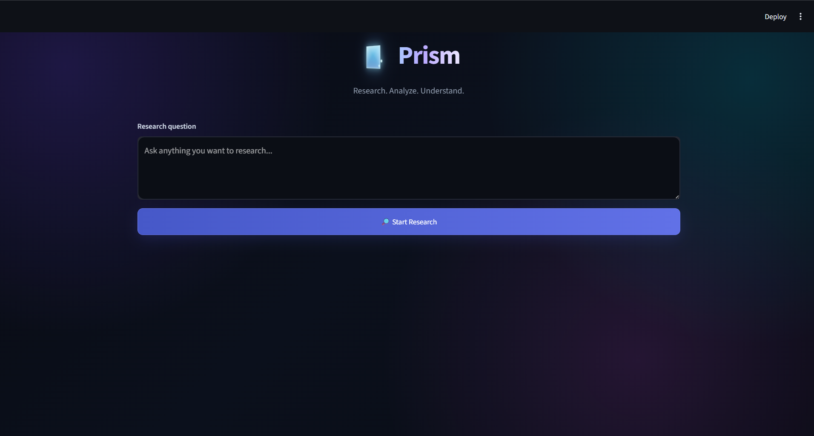
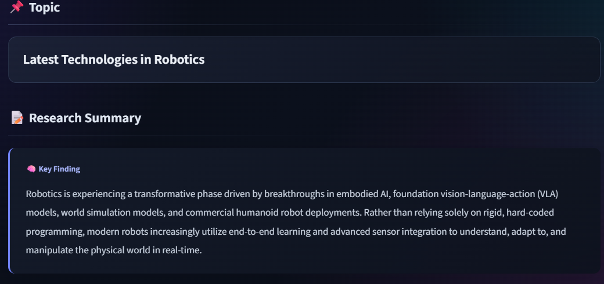
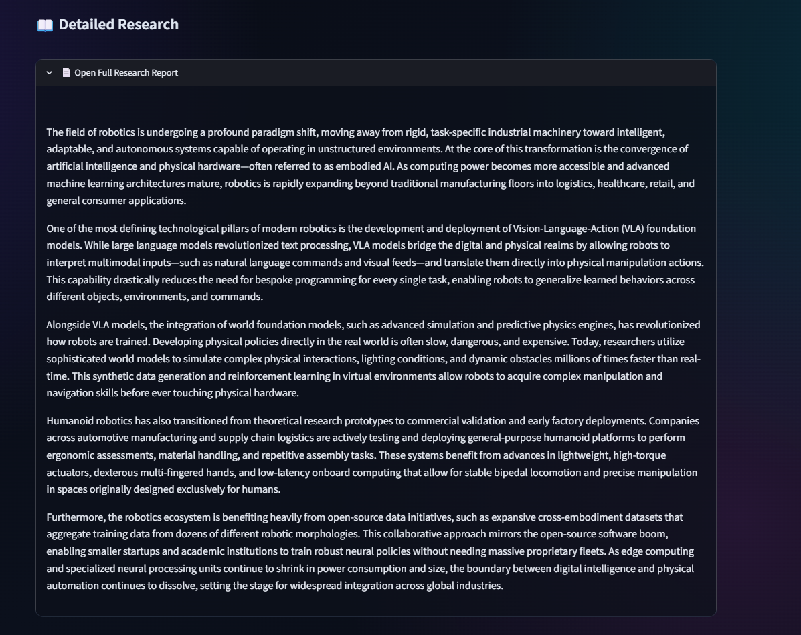
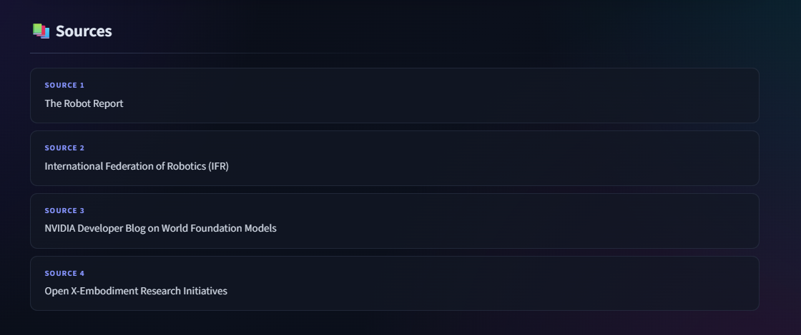

\

**# 🔷 PRISM**

**### AI-Powered Research Agent**

**\*\*Research. Analyze. Understand.\*\***

\ 

\

\ \ 

\> 🔎 An AI-powered research assistant that searches the web, analyzes information, and generates detailed research reports.

\ 

![Python]\(https\://img.shields.io/badge/Python-3.x-blue?style=for-the-badge&logo=python)

![Streamlit]\(https\://img.shields.io/badge/Streamlit-App-red?style=for-the-badge&logo=streamlit)

![LangChain]\(https\://img.shields.io/badge/LangChain-AI%20Framework-green?style=for-the-badge)

![GitHub]\(https\://img.shields.io/badge/GitHub-Public-black?style=for-the-badge&logo=github)

\

**---**

**# 📌 Table of Contents**

\- [🧠 What is Prism?]\(#-what-is-prism)

\- [🎯 Why I Built Prism]\(#-why-i-built-prism)

\- [✨ What Prism Can Do]\(#-what-prism-can-do)

\- [⚙️ How Prism Works]\(#️-how-prism-works)

\- [📸 Screenshots]\(#-screenshots)

\- [🛠️ Technologies Used]\(#️-technologies-used)

\- [📁 Project Structure]\(#-project-structure)

\- [🚀 Installation]\(#-installation)

\- [🔐 Environment Variables]\(#-environment-variables)

\- [▶️ Running Prism]\(#️-running-prism)

\- [🔍 Example Research Questions]\(#-example-research-questions)

\- [📄 Research Output]\(#-research-output)

\- [🔒 Security]\(#-security)

\- [🚧 Limitations]\(#-limitations)

\- [🔮 Future Improvements]\(#-future-improvements)

\- [🤝 Contributing]\(#-contributing)

\- [📜 License]\(#-license)

\- [👨‍💻 Author]\(#-author)

**---**

**# 🧠 What is Prism?**

**\*\*Prism\*\*** is an AI-powered research agent built using Python.

It is designed to help users research a topic without manually searching through many different websites and reading large amounts of information.

Instead of simply providing a short AI-generated answer, Prism follows a research-oriented workflow.

The user provides a research question, and Prism uses available research tools to gather information, analyze it, and produce both a concise summary and a much more detailed research report.

**### 🔄 Basic workflow**

\`\`\`text

                 👤 USER

                    │

                    ▼

          💬 Research Question

                    │

                    ▼

             🔎 Web Research

                    │

                    ▼

             🧠 AI Analysis

                    │

          ┌─────────┴─────────┐

          ▼                   ▼

     📝 Summary        📚 Detailed Report

          │                   │

          └─────────┬─────────┘

                    ▼

               🔗 Sources

                    │

                    ▼

                💾 Save

🎯 Why I Built Prism

Prism was built as a project to explore how AI agents can combine multiple technologies and tools to perform useful real-world tasks.

The project combines:

🤖 Artificial Intelligence

🧠 Large Language Models

🔎 Web Search

🛠️ AI Tools

🐍 Python

🎨 Streamlit

📄 Automated Research Reports

The main idea behind Prism is simple:

Instead of making the user do the research manually, let an AI agent handle the research workflow.

This project also helped me understand how AI agents can go beyond simple question-and-answer systems by interacting with external tools.

✨ What Prism Can Do:

Prism currently provides several research capabilities.

🔎 1. Web Research

Prism can search the web for information relevant to the user's research question.

This allows the agent to retrieve information beyond the knowledge contained inside the language model.

📚 2. Knowledge Retrieval

Prism can use knowledge sources such as Wikipedia along with web search tools to gather additional context.

🧠 3. Information Analysis

After gathering information, Prism analyzes the collected material and determines the important findings relevant to the research question.

📝 4. Research Summary

Prism generates a concise summary containing the most important findings.

The summary is designed to give the user a quick understanding of the research without reading the entire report.

📖 5. Detailed Research Report

Prism also generates a much more comprehensive research report.

The report can contain:

Introduction

Background

Historical context

Important events

Major developments

Causes and reasons

Consequences

Different perspectives

Important dates

Numbers and statistics

Current developments

Conclusion

The goal is to make the output feel more like a research article rather than a short chatbot response.

🔗 6. Sources

Prism provides the sources used during the research process so that users can understand where the information came from.

💾 7. Save Research

Research results can be saved as text files inside the Researches directory.

This makes it possible to keep previous research instead of losing it after closing the application.

->

        ⚙️ How Prism Works

        Prism follows a multi-step research workflow.

        Step 1 — User provides a question

        The user enters something such as:

        What are the latest developments in reusable rockets?

        Step 2 — Prism determines the research requirements

        The AI analyzes the question and determines what type of information is required.

        For time-sensitive questions, recent information should be prioritized.

        Step 3 — Research tools are used

        Prism can use tools such as:

        🔎 DuckDuckGo Search

        📖 Wikipedia

        These tools help the agent retrieve external information.

        Step 4 — Information is analyzed

        The AI analyzes the information gathered from the research tools.

        It attempts to identify:

        Important facts

        Relevant events

        Key people

        Important organizations

        Dates

        Causes

        Consequences

        Current developments

        Step 5 — Summary is generated

        Prism creates a concise summary containing the key findings.

        Step 6 — Detailed report is generated

        Prism then produces a substantially longer report explaining the topic in greater depth.

        Step 7 — Sources are presented

        The sources used during the research are presented to the user.

        Step 8 — Research can be saved

        The detailed research can be saved as a .txt file.

<->📸 Screenshots <->

        🏠 Prism Interface

        The main Prism interface allows the user to enter a research question and start the research process.

        \
 \ \

        📝 Research Summary

        After completing the research, Prism presents a concise summary of the most important findings.

        \
 \ \

        📚 Detailed Research Report

        Prism generates a much more comprehensive report for users who want to understand the topic deeply.

        \
 \ \

        🔗 Sources

        The application also displays the sources used during the research.

        \
 \ \

🛠️ Technologies Used ->

Technology                    Purpose

 🐍 Python              Core programming language

 🤖 LangChain           AI agent and tool integration

 🔎 DuckDuckGo          Web search

 📖 Wikipedia           Knowledge retrieval

 🎨 Streamlit           Web interface

 🔐 python-dotenv       Environment variable management

 📁 pathlib             File and directory management

🚀 Installation --->

        Follow these steps if you want to run Prism on your own computer.

1️⃣ Clone the repository:

        in terminal ->

                git clone https\://github.com/hemachandramenni07/prism-ai-research-agent.git

Move into the project directory:

        in terminal ->

                cd prism-ai-research-agent

2️⃣ Create a virtual environment:

Create a Python virtual environment:

        in terminal ->

                python -m venv agent

This creates an isolated Python environment for Prism

3️⃣ Activate the virtual environment:

in terminal ->

        agent\Scripts\activate

You should see something similar to:

        (agent) C:\Users\\...\prism-ai-research-agent>

4️⃣ Install dependencies:

Install all required Python packages:

        in terminal ->

                pip install -r requirements.txt

🔐 Environment Variables

Prism may require API credentials depending on the AI model configuration.

Create a file named:

        .env

in that file :

        API\_KEY="your\_api\_key\_here"

Use the exact variable names required by your implementation.

▶️ Running Prism:

After activating the virtual environment and installing the dependencies, run:

        in terminal ->

                streamlit run app.py

Streamlit should start a local web server.

You will then be able to open Prism in your browser.

\*\*\* IMPORTANT \*\*\*

🚧 Limitations ->

Prism is an evolving project and currently has some limitations.

For example:

🌐 Search results depend on external search providers.

🧠 AI-generated information should still be verified.

⏱️ Research speed depends on network and model response times.

📚 Different sources may contain conflicting information.

🔎 Search engines may return incomplete or outdated information.

🤖 AI systems can sometimes misunderstand a research question.

For important topics, users should verify critical information using the original sources.

📜 License ->

This project currently does not include a specific open-source license.

If you decide to make Prism open source, consider adding an appropriate license such as MIT.

👨‍💻 Author

\

Hemachandra Menni

Computer Science Student

AI / Software Development Enthusiast

🔷 Prism — AI Research Agent

Research. Analyze. Understand.

\

\

⭐ If you find this project interesting, consider giving the repository a star!

\
 \`\`\`